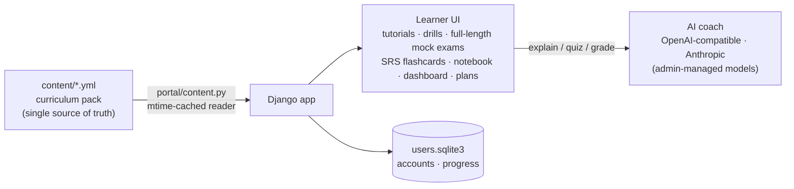

<div align="center">

# 🧬 Gabay

**From outline to mastery — a complete study companion for two medical-school entrance exams.**

*Philippine NMAT (CEM) · US MCAT (AAMC)*


[Features](#-features) · [Curriculum](#-the-curriculum-at-a-glance) · [Quickstart](#-quickstart) · [How it works](#-how-it-works) · [Deploy](#-deploying-for-real) · [Built with AI](#-built-with-ai-agents) · [License](#%EF%B8%8F-sources--license)

</div>

---

## ✨ Features

| | |
| --- | --- |
| 🗺️ **Dual-exam curriculum map** | 13 subjects covering NMAT Part 1 & 2 and all four MCAT sections, with shared science subjects merged — no duplicated pages, no fake chapters beyond the official blueprints |
| 📖 **Teaching chapters** | Full-textbook tutorials: overview → teaching sections with figures → worked examples → key points → pitfalls → per-exam mapping, every chapter citing its sources — plus subject key terms, cross-discipline bridges, clinical links into the disease library, high-yield badges, and one-click PDF export |
| 🎯 **Strategy library** | 8 original test-taking technique guides — passage triage, process of elimination, unit analysis, CARS passage mapping, timing protocol, flag discipline, guessing policy, the review loop |
| 📝 **High-yield notes** | 453 one-line bullets across 70 outline chapters, plus 149 practice MCQs and a 770-question bank (NMAT 240 + MCAT 230 full-length mocks + 300 practice-only drill items, 32 passages) |
| 🔎 **Materials desk** | 146-term searchable glossary, 114 formulas in per-subject sheets, exam tips, study paths, and checklists |
| 🩺 **Disease library** | 8 mechanism-first articles (TB, dengue, MI, …) bridging basic science to clinical intuition — enrichment reading, honestly labeled as such |
| 🔁 **Spaced-repetition flashcards** | SM-2-style scheduling over the full 625-card deck: due queue, new cards capped per session, Again/Hard/Good/Easy grading, per-subject decks |
| ✅ **Mock exams & progress tracking** | Real-mode full-length simulations (server-authoritative clocks, autosave, retake variants that reshuffle items and options, per-question review), wrong-answer notebook with redo, study-plan generator, per-chapter progress |
| 🖼️ **Real figures, not text about figures** | Diagram items render generated SVG art — NMAT Part 1 perception/induction panels, circuits, titration and kinetics plots, pedigrees, pathway maps — balanced A–D answer keys across the bank |
| 📊 **Score interpreter** | Convert mock-exam percentages to the NMAT 200–800 scale (with CHED 40th / Metro Manila / UST-Ateneo / UP percentile reference rows) or MCAT 118–132 sections — labeled planning estimates |
| 🤖 **AI study coach, model-agnostic** | Explain / quiz / grade modes, grounded in whichever chapter you are reading. Any OpenAI-compatible endpoint or Anthropic API — admins add, delete, and switch models at runtime |
| 📁 **File-based content** | The entire curriculum is version-controlled YAML: edit, validate, push — no database migration, no build step |

## 📚 The curriculum at a glance

| Collection | Count |
| --- | --- |
| Subjects (5 shared · 4 NMAT-only · 4 MCAT sections) | **13** |
| Outline chapters mapped to CEM / AAMC blueprints | **70** |
| High-yield note bullets | **453** |
| Practice MCQs with explanations | **149** |
| Glossary terms / formula entries | **146 / 114** |
| Strategy guides | **8** |
| Flashcards (spaced repetition) | **625** across 13 subject decks |
| Exam tips / study paths / checklists | **21 / 7 / 3** |
| Disease articles | **8** |
| Full textbook tutorials | **70 / 70 — complete** |
| Mock-exam + drill questions | **770** + 32 passages |

Everything lives in [`content/`](content/) as plain YAML and is documented
standalone in [`content/README.md`](content/README.md). Per-chapter tutorial
fill progress is tracked in
[`content/docs/PROGRESS.md`](content/docs/PROGRESS.md).

## 🚀 Quickstart

```bash
git clone https://github.com/brentwong-kiel1997/NMAT_MCAT_PREP.git
cd NMAT_MCAT_PREP

python3 -m venv .venv
.venv/bin/pip install -r requirements.txt

# keep runtime data (user DB) inside the checkout
export GABAY_RUNTIME_DIR="$PWD/runtime"

# required: the app refuses to start without a secret (never commit one)
export DJANGO_SECRET_KEY="$(python3 -c 'import secrets; print(secrets.token_urlsafe(64))')"

.venv/bin/python manage.py migrate
.venv/bin/python manage.py ensure_admin --username admin --password <pick-one>
.venv/bin/python manage.py runserver
```

Open <http://127.0.0.1:8000/> — register your own account at `/register/`,
or sign in as the admin you just created.

<details>
<summary><strong>Enabling the AI study coach (optional)</strong></summary>

The coach needs at least one AI model. Sign in as a staff user and open
**Manage → Models** to add any OpenAI-compatible endpoint or an Anthropic API
key, then mark one model as current. Without a model, everything else works —
only the coach is offline.

</details>

<details>
<summary><strong>Editing curriculum content</strong></summary>

```bash
# edit content/**/*.yml, then:
.venv/bin/python manage.py validate_content    # structural self-check
.venv/bin/python manage.py refresh_manifest    # update MANIFEST.json (commit it too)
```

Stability rules — subject slugs, question ids, and chapter order key the
progress records — are documented in
[`content/README.md`](content/README.md#editing-rules).

</details>

## 🧩 How it works



- **Content is files, not tables.** The reader parses YAML on demand and
  caches on file mtimes — an edit takes effect on the next request.
- **One small database, for the right reason.** `users.sqlite3` holds only
  what truly mutates at runtime: accounts, sessions, and learner progress.
- **A deploy gate guards content.** Every deploy runs `validate_content`
  against `MANIFEST.json` hashes and structural invariants; broken content
  fails loudly while the old processes keep serving.

## 🚢 Deploying for real

The quickstart above is for poking at the app locally. Running it as a
service — bare-repo push-to-deploy, systemd gunicorn, nginx TLS with a
password front door, secrets outside git, backups — is documented step by
step in [`DEPLOYMENT.md`](DEPLOYMENT.md).

## 🔐 Security posture

- **No secrets in git.** `DJANGO_SECRET_KEY` is required at startup (env var
  or `.env` file) — the app refuses to boot without it. AI-provider API keys
  are Fernet-encrypted at rest in the database, keyed off the secret.
- **Sessions are the only identity.** Progress/practice/coach APIs answer
  only to the logged-in user; anonymous callers get `401`, and no header can
  impersonate anyone.
- **Self-serve accounts.** Anyone can register at `/register/`; staff accounts
  stay admin-managed.
- **Tests + CI.** `manage.py test` covers the auth gates, registration,
  field crypto, and the mock-exam engine; GitHub Actions runs it plus
  `validate_content` on every push.

## 🤖 Built with AI agents

This project was developed pair-style with an AI coding agent end to end —
architecture, migrations, content pipeline, and this README:

| | |
| --- | --- |
| **Agent** | [Claude Code](https://claude.com/claude-code) — CLI coding agent (file edits, shell, git, deploys) |
| **Model** | **GLM**, trained by Z.ai — the model powering the agent |

The AI *inside the product* is separate and swappable: the study coach calls
whatever model an administrator registers — any **OpenAI-compatible** endpoint
or the **Anthropic** Messages API (see *Manage → Models*). All curriculum
content written by the agent is original prose, with every external source
declared in [`content/SOURCES.yml`](content/SOURCES.yml).

## ⚖️ Sources & license

### License of this repository

| Part | License | In one line |
| --- | --- | --- |
| Source code & config (everything except `content/`) | **MIT** — [LICENSE](LICENSE) | use for any purpose, keep the notice |
| Curriculum content pack (`content/`) | **CC BY-NC-SA 4.0** — [content/LICENSE.md](content/LICENSE.md) | use, adapt, and redistribute non-commercially with credit; adaptations carry the same license |

### Data sources

All teaching content is **original writing for this project**. External
references are consulted for facts and coverage only — never copied:

| Source | Used for | Source's license | How |
| --- | --- | --- | --- |
| OpenStax textbooks (*Biology 2e* et al.) | Tutorial facts & structure | CC BY-NC-SA 4.0 | consulted only — facts and outline, no text |
| AAMC, *What's on the MCAT Exam* | MCAT section mapping | © AAMC — public outline | paraphrased mapping |
| CEM NMAT test description | NMAT structure & timing | © CEM — public description | paraphrased mapping |
| AI provider APIs (OpenAI-compatible / Anthropic) | Study-coach backend | commercial APIs | runtime calls; no content sourced |

Exact editions, access dates, and per-chapter declarations live in
[`content/SOURCES.yml`](content/SOURCES.yml), enforced by the validation gate.

### Trademarks

NMAT is a trademark of the Center for Educational Measurement, Inc. MCAT is a
trademark of the Association of American Medical Colleges. This independent
study project is not affiliated with, sponsored by, or endorsed by either
organization.

---

<div align="center">

**Gabay** · tagalog for *guide* · built one chapter at a time

</div>
